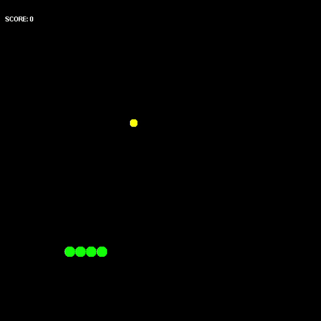

# Snake

Big classic Snake game.

The current version(v1.0) contains only one level
in the game session.

For launching the application from command line:

1. Go to the project root folder.
2. mvn clean install
3. java -cp "Snake.jar;target/*" com.examples.game.snake.SnakeGame

# Requirements for development

- At least JDK 8
- Maven 3